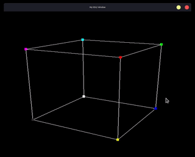

# SDL2 3D Cube Demo

This is a simple demo of a 3D Rotating cube using **SDL2** & **glm**. Practice for understanding `MVP` matrices.

    

## Controls

Key| Effect |
---|-------------------------------
 Q | Rotate Left
 E | Rotate Right
 O | Toggle Orghographic Projection

## Requirement
- glm `sudo apt install libglm-dev`
- SDL2 `sudo apt install libsdl2-dev`
- CMake
