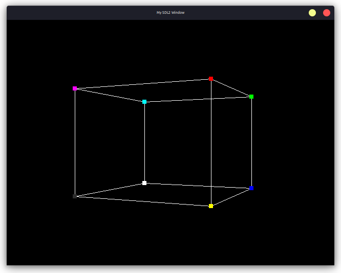
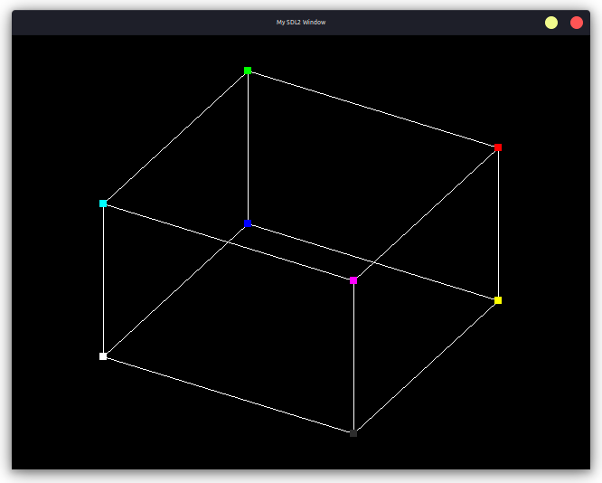

# SDL2 3D Cube Demo

This is a simple demo of a 3D cube using SDL2.

## Controls

Key| Effect |
---|-------------------------------
 Q | Rotate Left
 E | Rotate Right
 O | Toggle Orghographic Projection
